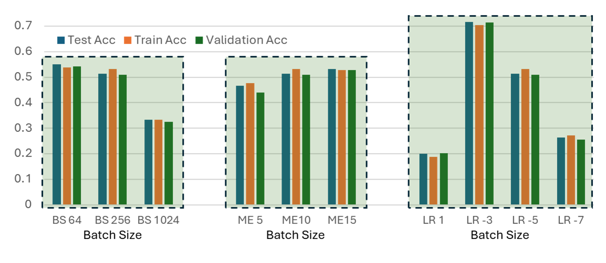
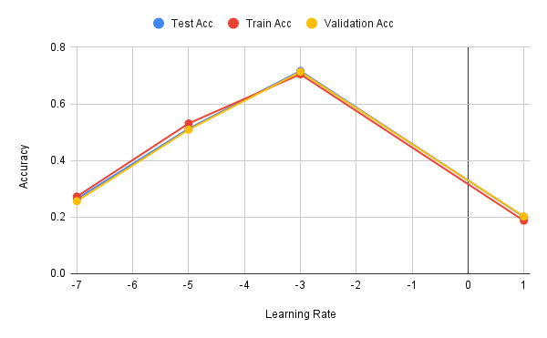
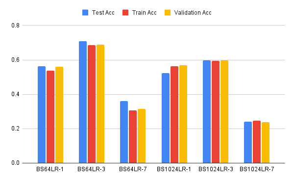
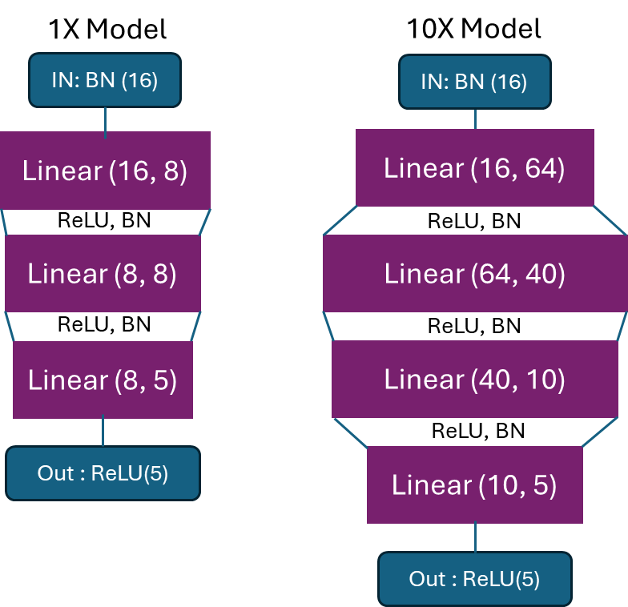

# Lab 1
A base configuration has been established to systematically evaluate the impact of the three key factors on the model. These parameters include batch-size, max-epochs and learning-rate.

 <!-- 将根据训练测试训练的精度从以下方面进行评估，如非特别说明，则参数与Base一致。由于本门课注重提升模型运算速度方面，因此我还在训练的时候执行了`$ nivtop`指令 -->
 The accuracy of test, training and validation will be evaluated using the following parameters, the bolded numbers are the values of base. This approach ensures a comprehensive analysis of the model's behavior under different parameter settings.Unless specified, the parameters are consistent with Base. Since this course focuses on improving the model calculation speed, I also executed the `$nivtop` command during training. 
 <!-- 加粗的数字是base的值 -->

* Training with Different Batch Sizes: 64, **256**, 1024
* Training with Different Epochs： 5, **10**, 15
* Training with Different Learning Rates 1e-3,**1e-5**, 1e-7

The comparision between each trails is shown as follows：



<!-- 从图中可以看出，各种参数配置下的训练测试验证准确率接近，没有出现明显的过拟合。这是因为模型只有三层网络，较为简单。
下面对问题进行分析： -->
Where BS reffers to batch size, ME reffers to max epoch, and LR7 reffers to `learning rate = 1e-7`.As can be seen from the figure above, the training and test verification accuracy under various parameter configurations are close, and there is no obvious overfitting. This is because the model has only three layers of network and is relatively simple.

The problem is analyzed below:
## 1. What is the impact of varying batch sizes and why?
<!-- 在收敛速度方面，batch size 越大，收敛越慢。其中BS 64 30k step收敛，BS 256 15k step 收敛，但是BS1024没有在10 epoh内收敛。这是因为BS大，导致每个Epoc内的step少，总共10个Epoc只有7k step，因此没有收敛.

在训练速度方面，可以明显感受到BS64的训练时长最大，1024最小。这是因为64每个epoc中step更多，参数更新更频繁。同时注意到1024的GPU占用更高，这说明BS较大时，能够更好的使用GPU资源，进一步使得训练速度加快。

在准确率方面，当批量较小时，模型的准确率更高，因为这样模型可以避免陷入局部最小值并能在10个epoc中获得更多的参数更新。BS64的准确率最高。
这是因为较大的批量大小可能会导致模型陷入局部最小值或平原区域，使得梯度下降算法无法有效地更新参数。此外，较大的批量大小可能会增加训练过程中的噪声，并使优化过程更加不稳定。 -->
In terms of convergence speed, the larger the batch size (BS), the slower the convergence. Among them, BS 64 converged at 30k step and BS 256 converged at 15k step, but BS1024 did not converge within 10 epoch. This is because the BS is large, resulting in few steps in each epoch. When BS equals 10, there are only 7k steps in a total of 10 Epocs, so there is no convergence.

In terms of training speed, it can be clearly observed that BS64 has the longest training time and 1024 has the shortest. This is because 64 has more steps in each epoc and parameters are updated more frequently. At the same time, it is noted that the GPU usage of 1024 is higher, which shows that when the BS is larger, GPU resources can be better used, further speeding up the training.

In terms of accuracy, the accuracy of the model is higher when BS is smaller because the model can avoid getting stuck in local minima and get more parameter updates in 10 epocs. However, when batch size is too small, it may suffer from underfitting. As oberved, BS64 has the highest accuracy<!-- , but BS8 is clearly suffering from under fitting -->. Therefore, choosing a suitable batch size is important.


<!-- 内存占用： 更大的批量大小需要更多的内存，尤其是在GPU上训练时。较小的批量大小可能需要更少的内存，并且可以更轻松地适应内存受限的环境。

泛化性能： 一般来说，更小的批量大小可能会产生更好的泛化性能，因为它们会导致模型在训练时更多地遇到不同的样本。但是，这并不是绝对的规则，因为不同的批量大小可能会导致不同的正则化效果。 -->

## 2. What is the impact of varying maximum epoch number?

<!-- 对于不同的maximum epoch number，当数值越大时，运算时间越长。在CPU/GPU/RAM占用方面，三次尝试没有明显的区别。对于模型准确率而言，增加最大迭代次数通常会提高模型性能，因为模型有更多更新参数的机会。但是，如果设置的最大迭代次数太高，则模型训练时长会增大，并且一些复杂的模型可能会过拟合训练数据，导致在测试数据上的性能下降（本模型非常简单，没有过拟合出现）。 -->


For different value of maximum epoch (ME), the running time is longer when the value of ME is larger. 

In terms of CPU/GPU/RAM usage, there is no significant difference between the three attempts. 

For model accuracy, increasing the maximum number of iterations usually improves the model performance because the model has more opportunities to update the parameters. However, if the maximum number of iterations is set too high, the model training time increases and some complex models may overfit the training data, resulting in performance degradation on the test data (this model is very simple and no overfitting occurs).

## 3. What is happening with a large learning and what is happening with a small learning rate and why? What is the relationship between learning rates and batch sizes?
<!-- 对于不同的学习率而言，当使用较大的学习率时（例如1e-3），参数更新的步幅会更大，梯度下降的幅度更大，模型收敛到局部最优解的速度更快。这可能导致优化过程不稳定，当步幅过大时甚至无法收敛到最优解，过大学习率可能导致优化过程发散，使得损失函数值不断增加。然而，使用较小的学习率（例如1e-7）会使参数更新的步幅更小，梯度下降的幅度更小，需要更多的steps才能到达收敛。虽然小学习率能够带来更稳定的优化过程，但是，如果学习率设置得太小，优化过程可能会收敛得很慢。在本task中，可以明显看到随着学习率变小，准确率明显下降，这是因为小学习率的模型在10epochs时还没有收敛

为了验证学习率与批量大小之间存在的关系，又追加了两组实验。实验结果表明：通常情况下，较大的批量大小可以支持较大的学习率，因为每个参数更新步骤都基于更多的样本，这可以使梯度估计更稳定。相反，较小的批量大小可能需要较小的学习率，以避免梯度估计的不稳定性和优化过程的不收敛。 -->
For different learning rates, when a larger learning rate is used (e.g., 1e-3), the step size of the parameter update is larger, the gradient decreases more, and the model converges to the local optimal solution faster. 

This may lead to an unstable optimization process, which may not even converge to the optimal solution when the step size is too large, and a large learning rate may cause the optimization process to diverge, resulting in an increasing loss function value. 

However, using a smaller learning rate (e.g., 1e-7) results in smaller steps for parameter updates, smaller gradient decreases, and needed more steps to reach convergence. Although a small learning rate can lead to a more stable optimization process, the optimization process may converge slowly if the learning rate is set too small.

In this task, it can be clearly seen that as the learning rate becomes smaller, the accuracy decreases significantly, which is because the model with small learning rate has not converged at 10 epochs.



In order to verify the relationship between learning rate and batch size, two additional sets of experiments were conducted. The experimental results show that, in general, larger batch sizes can support larger learning rates because each parameter update step is based on more samples, which can make the gradient estimation more stable. On the contrary, smaller batch sizes may require smaller learning rates to avoid instability of the gradient estimation and non-convergence of the optimization process.


## 4. Implement a network that has in total around 10x more parameters than the toy network.


<!-- 在这个问题中，一个比 "toy" 网络大约有 10 倍参数量的神经网络被提出。具体而言，原模型327个参数，10X模型有4.4k个参数 这个网络具有更多的层和输入输出特征，以增加模型的复杂度。

网络结构如下图所示： -->
In this problem, a neural network with approximately 10 times the number of parameters than the "toy" network is proposed. Specifically, the original model has 327 parameters and the 10X model has 4.4k parameters. The 10X network has more layers and input and output features to increase the complexity of the model.

<!-- 在构建模型的过程中，为了确保网络具有较好的表现，尝试了sigmoid和tanh作为激活函数，尝试了不同线性层的输入输出特征的值。这种手动调整参数的方式非常耗费时间，应当使用Lab4中的调参方法。 -->
During the construction of the model, `sigmoid` and `tanh` were utilized as activation functions, and the values of the input and output features of the different linear layers were tried to ensure that the network had a better performance. This manual tuning of the parameters is very time consuming and the tuning method in Lab4 should be used.

The network structure is shown in the figure below:


<!-- 从上图可以看出，新模型在原模型的基础上，增加了一个LogicNets Layer，通过增加额外的隐藏层来增加参数量。同时，增加了每个线性层的输入输出参数数量，以增加每层的参数量。 -->

As can be seen from the above figure, the new model adds a LogicNets Layer to the original model to increase the number of parameters by adding additional hidden layers. Also, the number of input and output parameters for each linear layer is increased to increase the number of parameters per layer.

The detailed structure of the 1X and 10X model is list below.
            ## 10X Model ##
            nn.BatchNorm1d(16),
            nn.ReLU(16),

            nn.Linear(16, 64),  # Increase neurons
            nn.BatchNorm1d(64),
            nn.ReLU(64),
            # 2nd LogicNets Layer
            nn.Linear(64, 40),  # Increase neurons
            nn.BatchNorm1d(40),
            nn.ReLU(40),
            # 3rd LogicNets Layer
            nn.Linear(40, 10),  
            nn.BatchNorm1d(10),  
            nn.ReLU(10),
            # Additional Layer
            nn.Linear(10, 5),  
            nn.BatchNorm1d(5),  
            nn.ReLU(5),

            ## 1X Model ##
            nn.BatchNorm1d(16),  # input_quant       # 0
            nn.ReLU(16),  # 1
            nn.Linear(16, 8),  # linear              # 2
            nn.BatchNorm1d(8),  # output_quant       # 3
            nn.ReLU(8),  # 4
            # 2nd LogicNets Layer
            nn.Linear(8, 8),  # 5
            nn.BatchNorm1d(8),  # 6
            nn.ReLU(8),  # 7
            # 3rd LogicNets Layer
            nn.Linear(8, 5),  # 8
            nn.BatchNorm1d(5),  # 9
            nn.ReLU(5),


## 5. Test your implementation and evaluate its performance.

In this task, the newly constructed network with 10X parameters was evaluated, its performance is shown in the following table:

| Model | Test Acc    | Train Acc | Validation Acc |
|-------|-------------|-----------|----------------|
| 1X    | 0.7349      | 0.7276    | 0.7359         |
| 10X   | 0.7464      | 0.7443    | 0.7463         |

<!-- It can be interpreted that, 通过实施更大规模的网络，扩展了模型的参数容量，模型的测试准确率有小幅度的提高，并且训练和验证准确率也相应提高，没有过拟合出现。 -->
It can be interpreted that, by implementing a larger network that extends the parameter capacity of the model, there is a small increase in the testing accuracy of the model and a corresponding increase in training and validation accuracy with no overfitting occurring.


# Lab 2:

In this task, following work has been done:
1. Set up a dataset
2. Set up a model
3. Generate a `MaseGraph` from the model
4. Run Analysis and Transform passes on the `MaseGraph`

Now consider the following problems:

## 1. Explain the functionality of `report_graph_analysis_pass` and its printed jargons such as `placeholder`, `get_attr` ...

The functionality of `report_graph_analysis_pass` is generalizing analysis report for the
MaseGraph in the context of the torch.fx module.
It will print the summary of the model in the terminal or external file.

Its parameters are listed as follows:

**graph:** a MaseGraph object.

**pass_args:** a dictionary which contains argument such as `file_name`, this is a optional parameter, if there is no file name, the
result will be print in the terminal.

In this function, 


First, the code extract `file_name` from the dictionary `pass_args`. Then, the function called `graph.fx_graph` to get information.
and initiallize a void string `buff` to store the information of the report.

Then, it emulated attribute `module` and collected the types of nodes, such as `placeholder`, `get_attr`, `call_function`, `call_method`, `call_module`and `output`
and store the information in the string `layer_types`.

Next, it counted the numbers of different type of nodes, and store them in the dictionary count.

Finally, the function appends the `counts` and `layer_types` into the buffer and print the buffer in the terminal or a external file
according to if the name of file is given.

In conclusion, the function provides information about the summary of MaseGraph and the name of different types of node and layers
as well as number of each type of node. It return the original `MaseGraph` and a empty parameter. 
<!-- Function:-->

placeholder represents the input of the function. The name attribute specifies the name this value will take on. target is similarly the name of the argument. args holds either: 1) nothing, or 2) a single argument denoting the default parameter of the function input. kwargs is don’t-care. Placeholders correspond to the function parameters (e.g. x) in the graph printout.

get_attr retrieves a parameter from the module hierarchy. name is similarly the name the result of the fetch is assigned to. target is the fully-qualified name of the parameter’s position in the module hierarchy. args and kwargs are don’t-care

<!-- call_function applies a free function to some values. name is similarly the name of the value to assign to. target is the function to be applied. args and kwargs represent the arguments to the function, following the Python calling convention

call_module applies a module in the module hierarchy’s forward() method to given arguments. name is as previous. target is the fully-qualified name of the module in the module hierarchy to call. args and kwargs represent the arguments to invoke the module on, excluding the self argument.

call_method calls a method on a value. name is as similar. target is the string name of the method to apply to the self argument. args and kwargs represent the arguments to invoke the module on, including the self argument

output contains the output of the traced function in its args[0] attribute. This corresponds to the “return” statement in the Graph printout. -->


## 2. What are the functionalities of `profile_statistics_analysis_pass` and `report_node_meta_param_analysis_pass` respectively?

  profile_statistics_analysis_pass Functionality:

  This function is designed to perform profile statistics analysis on MaseGraph. The input parameters includes Arguments for the analysis pass, specifying various parameters for the analysis, such as the mode of analysis, target nodes for weight and activation statistics, configurations for weight and activation statistics, and input generator for activation profiling.

  First, it calls several graph iterator functions to perform different aspects of the analysis, such as registering statistic collections, profiling weights, profiling activations, and computing and unregistering statistics. then, it returns a tuple containing the modified MaseGraph and an empty dictionary.


  report_node_meta_param_analysis_pass Functionality:
  This function is designed to perform meta parameter analysis on nodes in MaseGraph and generate a report.
  It contains MaseGraph itself and optional arguments for the analysis pass, including options like which parameters to include in the report and the path to save the report.
  First, It iterates through nodes in the graph and collects information about node name, Fx Node operation, Mase type, Mase operation, and additional parameters based on the specified options.
  It formats the collected information into a table and logs the analysis report using a logger. If a save path is provided, it also saves the report to a file.
  Finally, it Returns a tuple containing the analyzed MaseGraph and an empty dictionary.

  <!-- In summary:

  profile_statistics_analysis_pass focuses on profiling and analyzing statistics related to weights and activations in a neural network graph.
  report_node_meta_param_analysis_pass focuses on analyzing and reporting meta parameters associated with nodes in a neural network graph, including common, hardware, and software parameters. -->


## 3. Explain why only 1 OP is changed after the `quantize_transform_pass` .
  <!-- `quantize_transform_pass`里提到的 "Quantisation" 是指量化，即将神经网络中的权重和激活值转换为具有较低表示位数的整数或定点数。这个过程有助于减少模型的计算和内存需求，特别是对于在资源受限环境中运行的模型。 -->
  The "quantize" mentioned in `quantize_transform_pass` refers to quantization, that is, converting the weights and activation values in the neural network into integers or fixed-point numbers with a lower representation number. This process helps reduce the computational and memory requirements of the model, especially for models running in resource-constrained environments.

  <!-- 在程序中，字典`pass_args`中的`"by"`的值为`“type”`, therefore, 只有 `graph_iterator_quantize_by_type`被执行, and `pass_args` 的`config`项中只包含`linear`, thus, only the OP `type="linear"` is changed. -->
  In the program, the value of `"by"` in the dictionary `pass_args` is `"type"`, therefore, only `graph_iterator_quantize_by_type` is executed. Besides, the `config` item of `pass_args` only contains `linear`, thus , only the OP `type="linear"` is changed. The result is shown in the following table.

| Original type   | OP           |   Total |   Changed |   Unchanged |
|-----------------|--------------|---------|-----------|-------------|
| BatchNorm1d     | batch_norm1d |       1 |         0 |           1 |
| Linear          | linear       |       1 |         1 |           0 |
| ReLU            | relu         |       2 |         0 |           2 |
| output          | output       |       1 |         0 |           1 |
| x               | placeholder  |       1 |         0 |           1 |


## 4. Write some code to traverse both `mg` and `ori_mg`, check and comment on the nodes in these two graphs.

<!-- 在这个问题中，我建立了与第前问相似的pass`summarize_quantization_analysis_pass_my`,在这个pass中，执行`graph_iterator_compare_nodes_my`。这个函数是从`graph_iterator_compare_nodes`修改而来，对`mg` and `ori_mg`中的每一个node进行对比，并且根据是否相同生成评论。 -->
In this problem, a pass `summarize_quantization_analysis_pass_my` is created similar to the previous question, in which `graph_iterator_compare_nodes_my` is executed. This function, modified from `graph_iterator_compare_nodes`, compares each node in `mg` and `ori_mg` and generates comments based on whether they are the same.

The result is shown as follows：

| Ori name    | New name       | MASE_TYPE           | Mase_OP     | Original type | Quantized type  | Changed | Comment                                   |
|-------------|----------------|---------------------|-------------|---------------|-----------------|---------|-------------------------------------------|
| x           | x              | placeholder         | placeholder | x             | x               | False   | The Actual target is SAME      :x        |
| seq_blocks_0| seq_blocks_0   | module              | batch_norm1d| BatchNorm1d  | BatchNorm1d    | False   | The Actual target is SAME      :BatchNorm1d(16, eps=1e-05, momentum=0.1, affine=True, track_running_stats=True)|
| seq_blocks_1| seq_blocks_1   | module_related_func | relu        | ReLU          | ReLU            | False   | The Actual target is SAME      :ReLU(inplace=True)|
| seq_blocks_2| seq_blocks_2   | module_related_func | linear      | Linear        | LinearInteger  | True    | The Actual target is DIFFERENT :LinearInteger(in_features=16, out_features=5, bias=True)/Linear(in_features=16, out_features=5, bias=True)|
| seq_blocks_3| seq_blocks_3   | module_related_func | relu        | ReLU          | ReLU            | False   | The Actual target is SAME      :ReLU(inplace=True)|
| output      | output         | output              | output      | output        | output          | False   | The Actual target is SAME      :output    |

It can be seen from the result that only the `seq_blocks_2` is different between `mg` and `ori_mg`.

## 5. Perform the same quantisation flow to the bigger JSC network that you have trained in lab1. You must be aware that now the `pass_args` for your custom network might be different if you have used more than the `Linear` layer in your network.

In this task, the trained model `jsc-toy10X` is loaded. This model can be find above.

the result is shown as follows:

| Original type   | OP           |   Total |   Changed |   Unchanged |
|-----------------|--------------|---------|-----------|-------------|
| BatchNorm1d     | batch_norm1d |       5 |         0 |           5 |
| Linear          | linear       |       4 |         4 |           0 |
| ReLU            | relu         |       5 |         5 |           0 |
| output          | output       |       1 |         0 |           1 |
| x               | placeholder  |       1 |         0 |           1 |

It can be interpreted from the table that only the layer with type of `Linear` and `ReLU` is changed.

Also, the `mg` and 'ori_mg` is traversed, indicating the sequence block 1, 2, 4, 5, 7, 8, 10, 11 and 13 is quantised.

| Ori name       | New name        | MASE_TYPE           | Mase_OP     | Original type | Quantized type  | Changed |
|----------------|-----------------|---------------------|-------------|---------------|-----------------|---------|
| x              | x               | placeholder         | placeholder | x             | x               | False   |
| seq_blocks_0   | seq_blocks_0    | module              | batch_norm1d| BatchNorm1d  | BatchNorm1d    | False   |
| seq_blocks_1   | seq_blocks_1    | module_related_func | relu        | ReLU          | ReLUInteger    | True    |
| seq_blocks_2   | seq_blocks_2    | module_related_func | linear      | Linear        | LinearInteger  | True    |
| seq_blocks_3   | seq_blocks_3    | module              | batch_norm1d| BatchNorm1d  | BatchNorm1d    | False   |
| seq_blocks_4   | seq_blocks_4    | module_related_func | relu        | ReLU          | ReLUInteger    | True    |
| seq_blocks_5   | seq_blocks_5    | module_related_func | linear      | Linear        | LinearInteger  | True    |
| seq_blocks_6   | seq_blocks_6    | module              | batch_norm1d| BatchNorm1d  | BatchNorm1d    | False   |
| seq_blocks_7   | seq_blocks_7    | module_related_func | relu        | ReLU          | ReLUInteger    | True    |
| seq_blocks_8   | seq_blocks_8    | module_related_func | linear      | Linear        | LinearInteger  | True    |
| seq_blocks_9   | seq_blocks_9    | module              | batch_norm1d| BatchNorm1d  | BatchNorm1d    | False   |
| seq_blocks_10  | seq_blocks_10   | module_related_func | relu        | ReLU          | ReLUInteger    | True    |
| seq_blocks_11  | seq_blocks_11   | module_related_func | linear      | Linear        | LinearInteger  | True    |
| seq_blocks_12  | seq_blocks_12   | module              | batch_norm1d| BatchNorm1d  | BatchNorm1d    | False   |
| seq_blocks_13  | seq_blocks_13   | module_related_func | relu        | ReLU          | ReLUInteger    | True    |
| output         | output          | output              | output      | output        | output          | False   |


## 6. Write code to show and verify that the weights of these layers are indeed quantised. You might need to go through the source code of the implementation of the quantisation pass and also the implementation of the [Quantized Layers](../../machop/chop/passes/transforms/quantize/quantized_modules/linear.py) .
<!-- 在本问中，仍然使用第三四问所采用的`jsc-tiny` model。根据先前问的结果，应该只有中间的linear层被改变。检查是否被quantised的最直接的办法是输出quantized weights。然而输出所有的weights不够直观，因此在文本呈现时选用precision。 -->
In this question, the `jsc-tiny` model used in Q3 and Q4 is still used, and based on the results of the previous question, only the middle linear layer should be quantized. The most straightforward way to check whether it has been quantized is to output the quantized weights; however, outputting all the weights will take up too much space, so precision was chosen for the text presentation.

| type      | mase_op | shape  | precision |
|-----------|---------|--------|-----------|
| quantised | relu    | 8, 16  |     32    |
| original  | relu    | 8, 16  |     32    |
|-----------|---------|--------|-----------|
| quantised | linear  | 8, 16  |   8, 4    |
| original  | linear  | 8, 16  |     32    |
|-----------|---------|--------|-----------|
| quantised | relu    | 8, 5   |     32    |
| original  | relu    | 8, 5   |     32    |


As shown in the table above, the linear layer is indeed quantified.

## 7. Load your own pre-trained JSC network, and perform perform the quantisation using the command line interface.
First, change the line 13 and 14 of configs/examples/jsc_toy_by_type_my.toml into following lines.
```
load_name = "/home/super_monkey/mase_new/mase_output/jsc-tiny_classification_jsc_Base/software/training_ckpts/best.ckpt"
load_type = "pl"
``` 
Then, run `./ch transform --config configs/examples/jsc_toy_by_type_my.toml --task cls ` in command line, and get the output below.

| Original type   | OP           |   Total |   Changed |   Unchanged |
|-----------------|--------------|---------|-----------|-------------|
| BatchNorm1d     | batch_norm1d |       1 |         0 |           1 |
| Linear          | linear       |       1 |         1 |           0 |
| ReLU            | relu         |       2 |         0 |           2 |
| output          | output       |       1 |         0 |           1 |
| x               | placeholder  |       1 |         0 |           1 |

## \[Optional] Write your own pass

In this task, a self-defined pass `calculate_flops_bitops_pass` is introduced. 
<!-- 在这个pass中，使用deepspeed中的`get_model_profile()`获取模型的Flops，然后遍历了`mg`中的所有node并统计bit操作，从而获取Bitops.使用训练好的模型`jsc-toy10X`来进行分析，程序运行正常，输出结果为`Total BitOPs: 162368, Total FLOPs: 67.78 K`。 -->
In this pass, `get_model_profile()` in deepspeed is used to get the Flops of the model, then iterated all the nodes in `mg` and counted the bit operations to get the Bitops.The trained model `jsc-toy10X` is used to perform the analysis, the program runs fine and the output is ` Total BitOPs: 162368, Total FLOPs: 67.78 K`.
