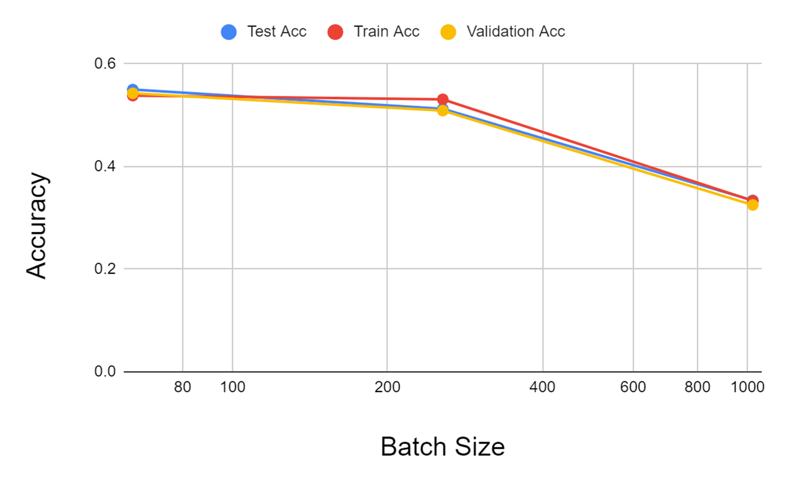
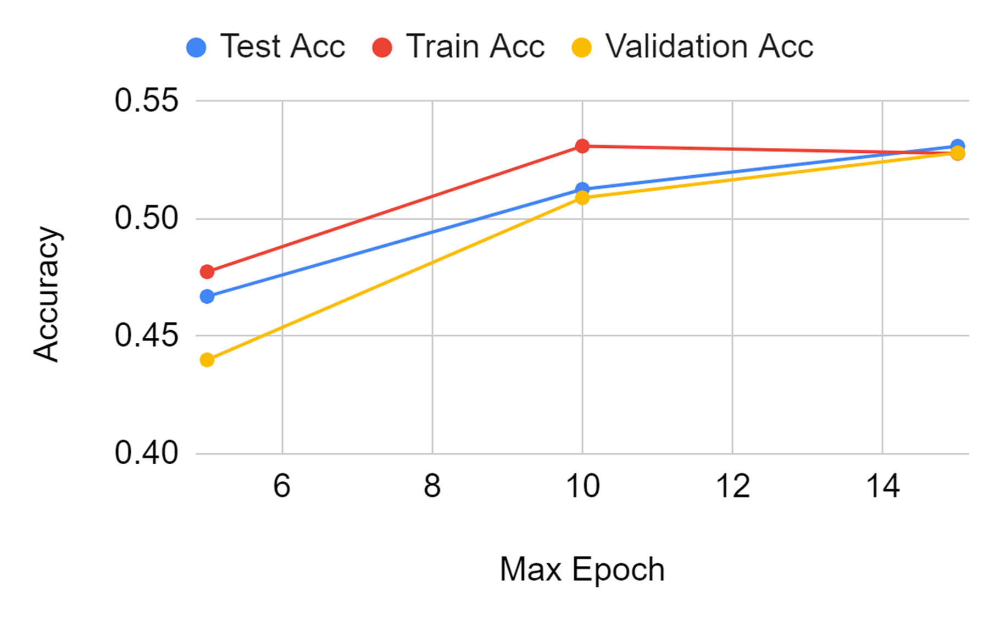
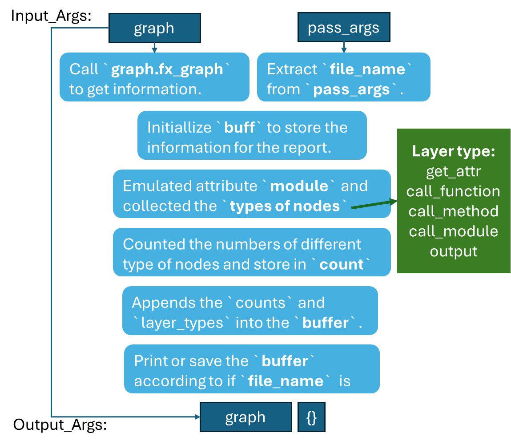

# Lab 1
A base configuration has been established to systematically evaluate the impact of the three key factors on the model. These parameters include batch-size, max-epochs and learning-rate.

* Training with Different Batch Sizes: 64, **256**, 1024
* Training with Different Epochs： 5, **10**, 15
* Training with Different Learning Rates 1e-3,**1e-5**, 1e-7

The comparision between each trails is shown as follows：


Where BS reffers to batch size, ME reffers to max epoch, and LR7 reffers to `learning rate = 1e-7`. As can be seen from the figure above these three factors significantly influence the model's performance. Additionally, the training and test verification accuracy under various parameter configurations are close, and there is no obvious overfitting. This is because the model has only three layers of network and is relatively simple.

The problem is analyzed below:
## 1. What is the impact of varying batch sizes and why?

In terms of convergence speed, the larger the batch size (BS), the slower the convergence. Among them, BS 64 converged at 30k step and BS 256 converged at 15k step, but BS1024 did not converge within 10 epoch. This is because the BS is large, resulting in few steps in each epoch. When BS equals 10, there are only 7k steps in a total of 10 Epocs, so there is no convergence.

In terms of training speed, it can be clearly observed that BS64 has the longest training time and 1024 has the shortest. This is because 64 has more steps in each epoc and parameters are updated more frequently. At the same time, it is noted that the GPU usage of 1024 is higher, which shows that when the BS is larger, GPU resources can be better used, further speeding up the training. This is probably because larger batch sizes require more memory, especially when training on the GPU. Smaller batch sizes may require less memory and can be more easily adapted to memory-constrained environments.



In terms of accuracy, as shown in the figure above, the accuracy of the model is higher when BS is smaller, because the model can avoid getting stuck in local minima and get more parameter updates in 10 epocs. However, when batch size is too small, it may suffer from underfitting. As oberved, in this particular case, BS64 has the highest accuracy<!-- , but BS8 is clearly suffering from under fitting -->. Therefore, choosing a suitable batch size is important. 

## 2. What is the impact of varying maximum epoch number?


For different value of maximum epoch (ME), the running time is longer when the value of ME is larger. 

In terms of CPU/GPU/RAM usage, there is no significant difference between the three attempts. 

For model accuracy, increasing the maximum number of iterations usually improves the model performance because the model has more opportunities to update the parameters. However, if the maximum number of iterations is set too high, the model training time increases and some complex models may overfit the training data, resulting in performance degradation on the test data (this model is very simple and no overfitting occurs).

## 3. What is happening with a large learning and what is happening with a small learning rate and why? What is the relationship between learning rates and batch sizes?


For different learning rates, when a larger learning rate is used (e.g., 1e-3), the step size of the parameter update is larger, the gradient decreases faster, and the model converges to the local optimal faster. This may lead to an unstable optimization process, which may not even converge to the optimal solution when the step size is too large, and a large learning rate may cause the optimization process to diverge, resulting in an increasing loss function value. 

However, using a smaller learning rate (e.g., 1e-7) results in smaller steps for parameter updates, smaller gradient decreases, and needed more steps to reach convergence. Although a small learning rate can lead to a more stable optimization process, the optimization process may converge slowly if the learning rate is set too small.

In this task, it can be clearly seen that as the learning rate becomes smaller, the accuracy decreases significantly, which is because the model with small learning rate has not converged at 10 epochs.


In order to verify the relationship between learning rate and batch size, two additional sets of experiments were conducted. The experimental results show that, in general, larger batch sizes can support larger learning rates because each parameter update step is based on more samples, which can make the gradient estimation more stable. On the contrary, smaller batch sizes may require smaller learning rates to avoid instability of the gradient estimation and non-convergence of the optimization process.


## 4. Implement a network that has in total around 10x more parameters than the toy network.

In this problem, a network with approximately 10 times the number of parameters than the "toy" network is proposed. The original model (hereinafter referred to as 1X) comprises 327 parameters, while the model with approximately 10 times more parameters (hereinafter referred to as 10X) consists of 4.4k parameters. The 10X network has more layers and input and output features to increase the complexity of the model. The network structure is shown in the figure below:


During the construction of the model, `sigmoid` and `tanh` were utilized as activation functions, and the values of the input and output features of the different linear layers were tried to ensure that the network had a better performance. This manual tuning of the parameters is very time consuming and the tuning method in Lab4 should be used.

As can be seen from the above figure, the new model adds a LogicNets Layer(Linear + BN +ReLU) to the original model to increase the number of parameters by adding additional hidden layers. Also, the number of input and output parameters for each linear layer is increased to increase the number of parameters per layer.

The detailed structure of the 1X and 10X model is list below.
            ## 10X Model ##
            nn.BatchNorm1d(16),
            nn.ReLU(16),

            nn.Linear(16, 64),  # Increase neurons
            nn.BatchNorm1d(64),
            nn.ReLU(64),
            # 2nd LogicNets Layer
            nn.Linear(64, 40),  # Increase neurons
            nn.BatchNorm1d(40),
            nn.ReLU(40),
            # 3rd LogicNets Layer
            nn.Linear(40, 10),  
            nn.BatchNorm1d(10),  
            nn.ReLU(10),
            # Additional Layer
            nn.Linear(10, 5),  
            nn.BatchNorm1d(5),  
            nn.ReLU(5),

            ## 1X Model ##
            nn.BatchNorm1d(16),  # input_quant       # 0
            nn.ReLU(16),  # 1
            nn.Linear(16, 8),  # linear              # 2
            nn.BatchNorm1d(8),  # output_quant       # 3
            nn.ReLU(8),  # 4
            # 2nd LogicNets Layer
            nn.Linear(8, 8),  # 5
            nn.BatchNorm1d(8),  # 6
            nn.ReLU(8),  # 7
            # 3rd LogicNets Layer
            nn.Linear(8, 5),  # 8
            nn.BatchNorm1d(5),  # 9
            nn.ReLU(5),


## 5. Test your implementation and evaluate its performance.

In this task, the newly constructed network with 10X parameters was evaluated, its performance is shown in the following table:

| Model | Test Acc    | Train Acc | Validation Acc |
|-------|-------------|-----------|----------------|
| 1X    | 0.7349      | 0.7276    | 0.7359         |
| 10X   | 0.7464      | 0.7443    | 0.7463         |

It can be interpreted that, by implementing a larger network that extends the parameter capacity of the model, there is a small increase in the testing accuracy of the model and a corresponding increase in training and validation accuracy with no overfitting occurring.


# Lab 2:

In this task, following work has been done:
1. Set up a dataset
2. Set up a model
3. Generate a `MaseGraph` from the model
4. Run Analysis and Transform passes on the `MaseGraph`

Now consider the following problems:

## 1. Explain the functionality of `report_graph_analysis_pass` and its printed jargons such as `placeholder`, `get_attr` ...

The functionality of `report_graph_analysis_pass` is generalizing analysis report for the
MaseGraph in the context of the torch.fx module.
It will print the summary of the model in the terminal or external file.

Its parameters are listed as follows:

**graph:** a MaseGraph object.

**pass_args:** a dictionary which contains argument such as `file_name`, this is a optional parameter, if there is no file name, the
result will be print in the terminal.

The functionality of `report_graph_analysis_pass` is illustrated in the figure below. This  function provides information about the summary of MaseGraph and the name of different types of node and layers
as well as number of each type of node. It return the original `MaseGraph` and a empty parameter. It is a report pass, it did not make any modification to the graph



The jargons will be explained below:
1. **placeholder** represents the input of the function, corresponding to the function parameters (e.g. x) in the graph printout.

2. **get_attr** retrieves parameters from the model, such as weight and bias. Its name is similarly the name the result of the fetch is assigned to.

3. **call_function** applies a free function to some values. 

4. **call_module** represents object-specific method invocation.

5. **call_method** call_method stands for the nn.model layers. In this task, it usually corresponds to `nn.Linear`, `nn.ReLU`, and `nn.BatchNorm1d`.

6. **output** contains the output of the traced function in its attribute. 


## 2. What are the functionalities of `profile_statistics_analysis_pass` and `report_node_meta_param_analysis_pass` respectively?

1. **profile_statistics_analysis_pass**: This function is designed to perform profile statistics analysis on MaseGraph, it focuses on profiling and analyzing statistics related to weights and activations in a graph. The input parameters includes Arguments for the analysis pass, specifying various parameters for the analysis, such as the mode of analysis, target nodes for weight and activation statistics, configurations for weight and activation statistics, and input generator for activation profiling.

First, the pass calls several graph iterator functions to perform different aspects of the analysis, such as registering statistic collections, profiling weights, profiling activations, and computing and unregistering statistics. Then, it returns a tuple containing the modified MaseGraph and an empty dictionary.

2. **report_node_meta_param_analysis_pass**: This function is designed to perform meta parameter analysis on nodes in MaseGraph and produce a report, it focuses on analyzing and reporting meta parameters associated with nodes in a graph, including common, hardware, and software parameters.. It includes MaseGraph itself s well as optional arguments for the analysis pass,such as the path to save the report and the parameters to include in the report.

First, It gathers data about node name, Fx Node operation, Mase type, Mase operation, and other parameterss based on the specified options. It uses a logger to record the analysis report and transforms the gathered data into a table. If a save path is provided, it also saves the report to a file. Finally, it Returns a tuple containing the analyzed MaseGraph and an empty dictionary.


## 3. Explain why only 1 OP is changed after the `quantize_transform_pass` .

The "quantize" mentioned in `quantize_transform_pass` refers to quantization, that is, converting the weights and activation values in the model into fixed-point numbers with a lower representation number. This process helps reduce the computational and memory requirements of the model, especially for models running in resource-constrained environments. 

In the program, the value of `"by"` in the dictionary `pass_args` is `"type"`, therefore, only `graph_iterator_quantize_by_type` is executed. Besides, the `config` item of `pass_args` only contains `linear`, thus , only the OP `type="linear"` is changed. The result is shown in the following table.

| Original type   | OP           |   Total |   Changed |   Unchanged |
|-----------------|--------------|---------|-----------|-------------|
| BatchNorm1d     | batch_norm1d |       1 |         0 |           1 |
| **Linear**          | **linear**       |       **1** |         **1** |           **0** |
| ReLU            | relu         |       2 |         0 |           2 |
| output          | output       |       1 |         0 |           1 |
| x               | placeholder  |       1 |         0 |           1 |


## 4. Write some code to traverse both `mg` and `ori_mg`, check and comment on the nodes in these two graphs.

In this problem, a pass `summarize_quantization_analysis_pass_my` is created similar to the previous question, in which `graph_iterator_compare_nodes_my` is executed. This function, modified from `graph_iterator_compare_nodes`, compares each node in `mg` and `ori_mg` and generates comments based on whether they are the same.

The result is shown as follows：

| Ori name    | New name       | MASE_TYPE           | Mase_OP     | Original type | Quantized type  | Changed | Comment                                   |
|-------------|----------------|---------------------|-------------|---------------|-----------------|---------|-------------------------------------------|
| x           | x              | placeholder         | placeholder | x             | x               | False   | The Actual target is SAME      :x        |
| seq_blocks_0| seq_blocks_0   | module              | batch_norm1d| BatchNorm1d  | BatchNorm1d    | False   | The Actual target is SAME      :BatchNorm1d(16, eps=1e-05, momentum=0.1, affine=True, track_running_stats=True)|
| seq_blocks_1| seq_blocks_1   | module_related_func | relu        | ReLU          | ReLU            | False   | The Actual target is SAME      :ReLU(inplace=True)|
| **seq_blocks_2**| **seq_blocks_2**   | **module_related_func** | **linear**      | **Linear**        | **LinearInteger**  | **True**    | **The Actual target is DIFFERENT :LinearInteger(in_features=16, out_features=5, bias=True)/Linear(in_features=16, out_features=5, bias=True)**|
| seq_blocks_3| seq_blocks_3   | module_related_func | relu        | ReLU          | ReLU            | False   | The Actual target is SAME      :ReLU(inplace=True)|
| output      | output         | output              | output      | output        | output          | False   | The Actual target is SAME      :output    |

It can be seen from the result that only the `seq_blocks_2` is different between `mg` and `ori_mg`.

## 5. Perform the same quantisation flow to the bigger JSC network that you have trained in lab1. You must be aware that now the `pass_args` for your custom network might be different if you have used more than the `Linear` layer in your network.

In this task, the trained model `jsc-toy10X` is loaded. This model can be find above. The `pass_arg` is written to quantify the `linear` and `relu` layers.

the result is shown as follows:

| Original type   | OP           |   Total |   Changed |   Unchanged |
|-----------------|--------------|---------|-----------|-------------|
| BatchNorm1d     | batch_norm1d |       5 |         0 |           5 |
| **Linear**          | **linear**       |       **4** |         **4** |           **0** |
| **ReLU**            | **relu**         |       **5** |         **5** |           **0** |
| output          | output       |       1 |         0 |           1 |
| x               | placeholder  |       1 |         0 |           1 |

It can be interpreted from the table that only the layer with type of `Linear` and `ReLU` is changed.

Also, the `mg` and 'ori_mg` is traversed, indicating the sequence block 1, 2, 4, 5, 7, 8, 10, 11 and 13 is quantised.

| Ori name       | New name        | MASE_TYPE           | Mase_OP     | Original type | Quantized type  | Changed |
|----------------|-----------------|---------------------|-------------|---------------|-----------------|---------|
| x              | x               | placeholder         | placeholder | x             | x               | False   |
| seq_blocks_0   | seq_blocks_0    | module              | batch_norm1d| BatchNorm1d  | BatchNorm1d    | False   |
| **seq_blocks_1**   | **seq_blocks_1**    | module_related_func | relu        | ReLU          | ReLUInteger    | True    |
| **seq_blocks_2**   | **seq_blocks_2**    | module_related_func | linear      | Linear        | LinearInteger  | True    |
| seq_blocks_3   | seq_blocks_3    | module              | batch_norm1d| BatchNorm1d  | BatchNorm1d    | False   |
| **seq_blocks_4**   | **seq_blocks_4**    | module_related_func | relu        | ReLU          | ReLUInteger    | True    |
| **seq_blocks_5**   | **seq_blocks_5**    | module_related_func | linear      | Linear        | LinearInteger  | True    |
| seq_blocks_6   | seq_blocks_6    | module              | batch_norm1d| BatchNorm1d  | BatchNorm1d    | False   |
| **seq_blocks_7**   | **seq_blocks_7**    | module_related_func | relu        | ReLU          | ReLUInteger    | True    |
| **seq_blocks_8**   | **seq_blocks_8**    | module_related_func | linear      | Linear        | LinearInteger  | True    |
| seq_blocks_9   | seq_blocks_9    | module              | batch_norm1d| BatchNorm1d  | BatchNorm1d    | False   |
| **seq_blocks_10**  | **seq_blocks_10**   | module_related_func | relu        | ReLU          | ReLUInteger    | True    |
| **seq_blocks_11**  | **seq_blocks_11**   | module_related_func | linear      | Linear        | LinearInteger  | True    |
| seq_blocks_12  | seq_blocks_12   | module              | batch_norm1d| BatchNorm1d  | BatchNorm1d    | False   |
| **seq_blocks_13**  | **seq_blocks_13**   | module_related_func | relu        | ReLU          | ReLUInteger    | True    |
| output         | output          | output              | output      | output        | output          | False   |
It can be seen from the table above, all the Linear and relu layers have been modified, which is as expected, and the program runs with normal results.

## 6. Write code to show and verify that the weights of these layers are indeed quantised. You might need to go through the source code of the implementation of the quantisation pass and also the implementation of the [Quantized Layers](../../machop/chop/passes/transforms/quantize/quantized_modules/linear.py) .

In this question, the `jsc-tiny` model used in Q3 and Q4 is still used, and based on the results of the previous question, only the middle linear layer should be quantized. The most straightforward way to check whether it has been quantized is to output the quantized weights; however, outputting all the weights will take up too much space, so precision was chosen for the text presentation.

| type      | mase_op | shape  | precision |
|-----------|---------|--------|-----------|
| quantised | relu    | 8, 16  |     32    |
| original  | relu    | 8, 16  |     32    |
|-----------|---------|--------|-----------|
| **quantised** | **linear**  | **8**, **16**  |   **8**, **4**    |
| **original**  | **linear**  | **8**, **16**  |     **32**    |
|-----------|---------|--------|-----------|
| quantised | relu    | 8, 5   |     32    |
| original  | relu    | 8, 5   |     32    |

As shown in the table above, the precision of quantised linear layer is different from the original version, indicating that it is indeed quantified.

## 7. Load your own pre-trained JSC network, and perform perform the quantisation using the command line interface.
First, change the line 13 and 14 of configs/examples/jsc_toy_by_type_my.toml into following lines.
```
load_name = "/home/super_monkey/mase_new/mase_output/jsc-tiny_classification_jsc_Base/software/training_ckpts/best.ckpt"
load_type = "pl"
``` 
Then, run `./ch transform --config configs/examples/jsc_toy_by_type_my.toml --task cls ` in command line, and get the output below.

| Original type   | OP           |   Total |   Changed |   Unchanged |
|-----------------|--------------|---------|-----------|-------------|
| BatchNorm1d     | batch_norm1d |       1 |         0 |           1 |
| **Linear**          | **linear**       |       **1** |         **1** |           **0** |
| ReLU            | relu         |       2 |         0 |           2 |
| output          | output       |       1 |         0 |           1 |
| x               | placeholder  |       1 |         0 |           1 |

From the table, it can be interpred that only the linear layer has been changed, aligning precisely with the result obtained in Q3.

## \[Optional] Write your own pass

In this task, a self-defined pass `calculate_flops_bitops_pass` is introduced. 

In this task, a custom pass named `calculate_flops_bitops_pass` is introduced. This pass utilizes the function `get_model_profile()` from DeepSpeed to obtain the FLOPs and number of parameters of the model. It then enumerates through all the nodes in the Masegraph and calculates the bit operations to determine the Bitops. The pass takes a Masegraph object graph and a dictionary pass_args as input, and returns the original graph along with a new dictionary result_dict containing total_flops and total_bitops as the output.

```
def calculate_flops_bitops_pass(graph, pass_args: dict):

    flops, macs, params = get_model_profile(model=graph.model, input_shape=tuple([8,16]))
    ...
    for node in graph.fx_graph.nodes:
        ...
        if mase_type in ["module", "module_related_func"]:
            if mase_op in ["linear", "conv2d", "conv1d"]:
                ...
                data_in_cost += sum(data_in_0_meta["precision"]) * d_size
                weights_cost += sum(w_meta["precision"]) * w_size

    # on average how many bits do we pay per value?
    data_sum_bit = data_in_cost
    w_sum_bit = weights_cost
    total_bitops = data_sum_bit+w_sum_bit
    total_flops=flops
    dict={
        "total_flops": total_flops,
        "total_bitops": total_bitops,
        }
    return graph, dict

```
This pass can be called using `calculate_flops_bitops_pass(mg, pass_args)`, here is an example.

```
mg, ans = calculate_flops_bitops_pass(mg, pass_args)
print("Total BitOPs:", ans["total_bitops"])
print("Total FLOPs:", ans["total_flops"])
```
In this task, the trained model jsc-toy10X is utilized. When execution, the program successfully runs, and the output obtained is Total Bitops: 162368, Total FLOPs: 67.78 K
