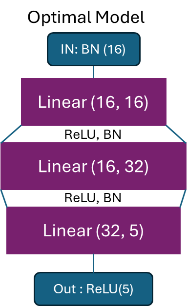

# Lab 3:
## 1. Explore additional metrics that can serve as quality metrics for the search process. For example, you can consider metrics such as latency, model size, or the number of FLOPs (floating-point operations) involved in the model.

During the search process, in addition to accuracy and loss, some additional metrics are added to evaluate the quality of the model. The definitions of metrics considered in this task are listed below:

* Latency: In this task, Latency is defined as the time required for model operation, that is, the time interval from input data to output result generation of each batch. Lower latency means better real-time performance of the model.
```
    ...
        elif j == num_batchs:
            end_time.record()
            torch.cuda.synchronize()  # Wait for all GPU operations to finish
            latency = start_time.elapsed_time(end_time) / num_batchs
    ...
```
* Model Size: refers to the size of the storage space occupied by the model, which is represented by the number of parameters in this experiment. Smaller model sizes reduce RAM usage and help run on IO bounded platforms. This information is collected together with FLOPS using the function `get_model_profile` , which is from the package of deepspeed.

* FLOPs: The number of floating point operations involved in a model's entire operation. The fewer FLOPs, the less computational complexity the model requires, the more computationally efficient it is, and the faster the calculation speed.

Model size and Flops can be obtained using following lines.
```
    flops, macs, params = get_model_profile(model=mg.model, input_shape=tuple(dummy_in['x'].shape))
```


## 2. Implement some of these additional metrics and attempt to combine them with the accuracy or loss quality metric. It’s important to note that in this particular case, accuracy and loss actually serve as the same quality metric (do you know why?).

By implementing such metrics searching in `search_space`, the following table is obtained:

| Search History    | Recorded Accuracies | Recorded Losses | Recorded Latencies | Recorded Model Sizes | Recorded FLOPS |
|-------------------|---------------------|-----------------|--------------------|----------------------|-----------------|
| [(16, 8), (16, 8)] | 0.47261905670166   | 1.2069          | 1.33173122406006  | 117                  | 1.92 K          |
| [(16, 8), (8, 6)]  | 0.316071437937873  | 1.4612          | 1.10885763168335  | 117                  | 1.92 K          |
| [(16, 8), (8, 4)]  | 0.376190483570099  | 1.4007          | 1.10261764526367  | 117                  | 1.92 K          |
| [(16, 8), (4, 2)]  | 0.34523810765573   | 1.4049          | 0.975513553619385 | 117                  | 1.92 K          |
| [(8, 6), (16, 8)]  | 0.428571445601327  | 1.3946          | 0.965023994445801 | 117                  | 1.92 K          |
| [(8, 6), (8, 6)]   | 0.390476199133055  | 1.3525          | 0.981292819976807 | 117                  | 1.92 K          |
| [(8, 6), (8, 4)]   | 0.446428579943521  | 1.3556          | 0.997523212432861 | 117                  | 1.92 K          |
| [(8, 6), (4, 2)]   | 0.445238104888371  | 1.3406          | 0.990246391296387 | 117                  | 1.92 K          |
| [(8, 4), (16, 8)]  | 0.466666681425912  | 1.2558          | 0.975551986694336 | 117                  | 1.92 K          |
| **[(8, 4), (8, 6)]**   | **0.533333337732724**  |**1.2949**           | **1.006764793396**    | **117**                  | **1.92 K**          |
| [(8, 4), (8, 4)]   | 0.523412704467773  | 1.3038          | 1.02436475753784  | 117                  | 1.92 K          |
| [(8, 4), (4, 2)]   | 0.383928579943521  | 1.3025          | 1.22784004211426  | 117                  | 1.92 K          |
| [(4, 2), (16, 8)]  | 0.516071438789368  | 1.3339          | 0.942265605926514 | 117                  | 1.92 K          |
| [(4, 2), (8, 6)]   | 0.515476199133056  | 1.3096          | 0.992268753051758 | 117                  | 1.92 K          |
| [(4, 2), (8, 4)]   | 0.514880959476743  | 1.3370          | 1.11617279052734  | 117                  | 1.92 K          |
| [(4, 2), (4, 2)]   | 0.490476195301328  | 1.2638          | 1.11920003890991  | 117                  | 1.92 K          |


It can be seen that under the conditions of this experiment, when `[('data_in_width', 'data_in_frac_width'), ('weight_width', 'weight_frac_width')]` is equal to `[(8, 4), (8, 6)]` , the best model is obtained, with highest accuracy of 0.53333333337732724.


At the same time, it can be noted that in the table, accuracy and loss represent can be regarded as similar metrics. This is because this is a classification problem calculated by a simple model and there is no obvious overfitting. In this case, accuracy and loss are related to each other and can be regarded as the same metric. For classification problems, accuracy is the index of concern in most cases, but accuracy itself is a non-differentiable equation, so cross-entropy is used as the loss function for optimization, but the final concern is accuracy.

For the inconsistency between loss and accuracy, there may be the following reasons:

1. If the labels of the data set are very uneven, for example, 80% of the data is Class 1, then increasing the proportion of Class 1 output by the model may increase the accuracy, but the increase in loss will be greater. The data set of this experiment is relatively evenly distributed and does not belong to this situation.
2. If the accuracy of the model is very high, the correct classification probability of most Classes is close to 1. If an error occurs at this time, the accuracy will be reduced very little, but the cross entropy may be very high. Obviously this is not the case in this experiment.
3. If the model is overfitted, it performs very well on the training set, but performs poorly on the test data. At this time, the loss of the model will be relatively small and the accuracy will be very low. The complexity of this model is very low, the training data is sufficient, and there is no overfitting.

## 3. Implement the brute-force search as an additional search method within the system, this would be a new search strategy in MASE.

 In Mase, there isn't an integrated brute-force strategy, but such a method can be added to `optuna.py`. We can refer to the documentation page at [BruteForceSampler](https://optuna.readthedocs.io/en/stable/reference/samplers/generated/optuna.samplers.BruteForceSampler.html). To accomplish this, simply add the following lines to the `sampler_map` function:
```
            case "brute-force":
                sampler = optuna.samplers.BruteForceSampler()
```
and the result are as follows:

Brute force Best trial(s):

|    |   number | software_metrics                   | hardware_metrics                                 | scaled_metrics                               |
|----|----------|------------------------------------|--------------------------------------------------|----------------------------------------------|
|  0 |        1 | {'loss': 1.356, 'accuracy': 0.514} | {'average_bitwidth': 8.0, 'memory_density': 4.0} | {'accuracy': 0.514, 'average_bitwidth': 1.6} |
|  1 |       19 | {'loss': 1.406, 'accuracy': 0.466} | {'average_bitwidth': 4.0, 'memory_density': 8.0} | {'accuracy': 0.466, 'average_bitwidth': 0.8} |


## 4. Compare the brute-force search with the TPE based search, in terms of sample efficiency. Comment on the performance difference between the two search methods

"sample efficiency" refers to the relationship between the number of samples required during hyperparameter optimization and the final performance it achieved. In other words, it measures how quickly an algorithm improves performance for a given number of samples.

Brute-force Search: The Brute-force search method is simple and straightforward. It tries all possible hyperparameter combinations, so its sample efficiency is usually lower. Its advantage is that it is guaranteed to find the global optimal solution (if the search space is large enough), but the cost is that it requires a lot of computing resources and time. Therefore, in large hyperparameter spaces, brute-force search may be less practical because it is less sample efficient.

TPE-based Search: TPE (Tree-structured Parzen Estimator) is a method based on Bayesian optimization that estimates the performance of different hyperparameter configurations by building a probabilistic model and selects the most promising configuration for the next evaluation. Compared with brute-force search, the TPE-based search method is generally more efficient because it is able to dynamically adjust the search space based on previous results during the search process and more effectively explore hyperparameter configurations that are likely to produce better performance. This dynamic adjustment feature allows TPE-based search to generally find better hyperparameter configurations for a given number of samples.

To prove this, the following experiment was conducted. To highlight the difference in search efficiency, `n_trails` was decreased to 1 and `search_space` is expand to approximately double its size. In total, 6 sets of experiments were conducted for TPE and Brute-force searches, respectively, where the accuracy of Best trails was recorded and averaged statistically.

| Sampler |  Brute-force      | TPE      |
|---------|-------------|-------------|
|  Best trails accuracy  | 0.4878571429| 0.5005714286|

It can be observed from the table that TPE has better performance than Brute-force search. In conclusion, the TPE search method is generally more sample efficient than the brute-force search method and it is more robust. It can find the nearly optimal model in a few trails.


# Lab 4:
## 1. Can you edit your code, so that we can modify the above network to have layers expanded to double their sizes? Note: you will have to change the ReLU also.

The code has been modified to double the parameters of each layer (including ReLU). The modification method includes adding a function called `instantiate_relu` to be able to modify the `ReLU` function. Apart from that, a check of the name parameter is added to the function`redefine_linear_Relu_transform_pass`. If `name` equals to `"inplace"`, the `ReLU` layer will be modified; otherwise, the linear layer is modified.
```
def instantiate_relu(inplace):
    return nn.ReLU(inplace=inplace)

def redefine_linear_Relu_transform_pass(graph, pass_args=None):
    ...
    for node in graph.fx_graph.nodes:
        ...
        config = main_config.get(node.name, default)['config']
        name = config.get("name", None)
        if name is not None:
            ori_module = graph.modules[node.target]
            if name == "inplace":
                ...
                new_module = instantiate_relu(inplace)
                ...
            else:
                ...
                if name == "output_only":
                    ...
                elif name == "both":
                    ...
                elif name == "input_only":
                    ...
                new_module = instantiate_linear(in_features, out_features, bias)
                ...
    return graph, {}
mg=reload_mg()
```
It is worth noting that there is only one changeable parameter inplace in `nn.ReLU()`, which is a Bool variable indicating whether to perform the `ReLU` operation in origianl place. Thus, as long as it is greater than 0, the result is not affected. Therefore, I think there is no need to specify the number of parameters when making modifications to the ReLU layer.

## 2. In lab3, we have implemented a grid search, can we use the grid search to search for the best channel multiplier value?

Yes, we only need to define `search_spaces` and change the `channel_multiplier` of each layer separately. Like the third question, first create a list to store all possible multipliers. Then we create `search_spaces` containing all multipliers. It should be noted that since the first of those three linear layers only affects the output layer, the second scales both the input and output uniformly, and the third only modifies the input layer, the multipliers for these three layers of networks should be the same. Therefore, to be extact, this process involves enumerating one by one from the list.
```
# base configuration
pass_base_cfg = {
    "by": "name",
    "default": {"config": {"name": None}},
    ...
    "seq_blocks_4": {                 # take seq_block_4 as an example
        "config": {
            "name": "both",
            "channel_multiplier": 1,  # In Bases configuration, channel_multiplier is set to 1
        }
    },
    ...
}

# build a search space
mul=[1,2,4,8,16,64]

search_spaces = []
search_history=[]
for x in (mul):
    pass_base_cfg[f'seq_blocks_2']['config']['channel_multiplier'] = x
    pass_base_cfg[f'seq_blocks_4']['config']['channel_multiplier'] = x
    pass_base_cfg[f'seq_blocks_6']['config']['channel_multiplier'] = x
    search_spaces.append(copy.deepcopy(pass_base_cfg))
    search_history.append(x)

```
The outcome of the search process are as follows.

| Search multipliers | Recorded Accuracies | Recorded Losses | Recorded Latencies | Recorded Model Sizes | Recorded FLOPS |
|----------------|---------------------|-----------------|--------------------|----------------------|-----------------|
| 1            | 0.183333335178239   | 1.6014          | 0.63633918762207  | 3.01 K               | 47.27 K         |
| 2            | 0.261111118963786   | 1.6086          | 0.609401607513428 | 10.09 K              | 159.66 K        |
| 4            | 0.107738098927907   | 1.6197          | 0.62485761642456  | 36.52 K              | 581.03 K        |
| 8            | 0.050000000212874   | 1.6231          | 0.705734395980835 | 138.53 K             | 2.21 M          |
| 16           | 0.188690478248256   | 1.6157          | 0.776793622970581 | 539.17 K             | 8.61 M          |
| 64           | 0.14880952664784    | 1.608           | 2.37203197479248  | 8.45 M               | 135.12 M        |

According to the table above, in this particular case, when multiplied by 2, the accuracy of the model is the highest and the number of model parameters is small, resulting in smaller FLOPS. So multiplying by 2 is the best option.

## 3. You may have noticed, one problem with the channel multiplier is that it scales all layers uniformly, ideally, we would like to be able to construct networks like the following, can you then design a search so that it can reach a network that can have this kind of structure?

Indeed, it is possible to modify the function by adjust the `channel_multiplier` parameter under the case `name: "both"` to take the form of (a, b). 
This configuration constructed the multiplication of the number of input features and output features by two different values, therefore, makes the network transformations more flexible.
```
"seq_blocks_6": {
        "config": {
            "name": "both",
            "channel_multiplier": (2,4),
        }
    },
```
In light of the compatibility concerns, it is necessary to modify the decision logic of name in `redefine_linear_Relu_transform_pass`, and realize automatic recognition of uniform and nonuniform scales instructions by evaluating the data type of `channel_multiplier`.
```
elif name == "both":
                    if type(config["channel_multiplier"])== int:
                        in_features = in_features * config["channel_multiplier"]
                        out_features = out_features * config["channel_multiplier"]
                    else:
                        in_features = in_features * config["channel_multiplier"][0]
                        out_features = out_features * config["channel_multiplier"][1]
```
Meanwhile, the integrity of the model must be taken into account. It is necessary to ensure that the number of input parameters of the previous layer and the output parameters of the next layer are the same, otherwise the model cannot run normally. The idea is to first create a list, such as `a=[(1,x),(x,y),(y,1)]`, where the input and output parameters of two adjacent layers are defined as identical variables x and y. Consequently, when searching, only these parameters need to be modified (in this case, altering the values of x and y), thereby safeguarding the accuracy and functionality of the model.

A search similar to Q2 is performed, and the search results are shown in the following table:

| Search History                     | Recorded Accuracies | Recorded Losses | Recorded Latencies | Recorded Model Sizes | Recorded FLOPS |
|------------------------------------|---------------------|------------------|---------------------|----------------------|-----------------|
| [1, (1, 1), (1, 1), (1, 1), 1]     | 0.227976194449833   | 1.605            | 0.556281614303589  | 3.01 K               | 47.27 K         |
| **[1, (1, 1), (1, 2), (2, 1), 1]**     | **0.251349210739136**   | **1.6107**           | **0.578835201263428**  | **5.45 K**               | **85.67 K**         |
| [1, (1, 1), (1, 4), (4, 1), 1]     | 0.164285718330315   | 1.6147           | 0.608767986297607  | 10.31 K              | 162.47 K        |
| [1, (1, 1), (1, 8), (8, 1), 1]     | 0.200000000851495   | 1.6066           | 0.62422399520874   | 20.04 K              | 316.07 K        |
| [1, (1, 1), (1, 16), (16, 1), 1]   | 0.228571429848671   | 1.6086           | 0.707788801193237  | 39.49 K              | 623.27 K        |
| [1, (1, 2), (2, 1), (1, 1), 1]     | 0.179761906819684   | 1.6122           | 0.623545598983765  | 5.61 K               | 88.49 K         |
| [1, (1, 2), (2, 2), (2, 1), 1]     | 0.164285715137209   | 1.6141           | 0.575072002410889  | 10.09 K              | 159.66 K        |
| [1, (1, 2), (2, 4), (4, 1), 1]     | 0.248809527073588   | 1.6076           | 0.689766407012939  | 19.05 K              | 301.99 K        |
| [1, (1, 2), (2, 8), (8, 1), 1]     | 0.327380959476743   | 1.6048           | 0.719059181213379  | 36.97 K              | 586.66 K        |
| [1, (1, 2), (2, 16), (16, 1), 1]   | 0.211904766304152   | 1.6118           | 0.75284481048584   | 72.81 K              | 1.16 M          |
| [1, (1, 4), (4, 1), (1, 1), 1]     | 0.20000000510897    | 1.6012           | 0.672563219070435  | 10.79 K              | 170.92 K        |
| [1, (1, 4), (4, 2), (2, 1), 1]     | 0.127976194024086   | 1.6100           | 0.683251190185547  | 19.36 K              | 307.62 K        |
| [1, (1, 4), (4, 4), (4, 1), 1]     | 0.145238096160548   | 1.6035           | 0.693862390518188  | 36.52 K              | 581.03 K        |
| [1, (1, 4), (4, 8), (8, 1), 1]     | 0.204761907458305   | 1.6091           | 0.695679998397827  | 70.82 K              | 1.13 M          |
| [1, (1, 4), (4, 16), (16, 1), 1]   | 0.164285714072841   | 1.6127           | 0.753260803222656  | 139.43 K             | 2.22 M          |
| [1, (1, 8), (8, 1), (1, 1), 1]     | 0.221428575260299   | 1.6008           | 0.731129598617554  | 21.16 K              | 335.78 K        |
| [1, (1, 8), (8, 2), (2, 1), 1]     | 0.159523812787873   | 1.6217           | 0.689951992034912  | 37.92 K              | 603.56 K        |
| [1, (1, 8), (8, 4), (4, 1), 1]     | 0.11547619423696    | 1.6101           | 0.689267206192017  | 71.46 K              | 1.14 M          |
| [1, (1, 8), (8, 8), (8, 1), 1]     | 0.15000000170299    | 1.6145           | 0.767404794692993  | 138.53 K             | 2.21 M          |
| [1, (1, 8), (8, 16), (16, 1), 1]   | 0.159523811723505   | 1.6181           | 0.732582378387451  | 272.68 K             | 4.35 M          |
| [1, (1, 16), (16, 1), (1, 1), 1]   | 0.132142862038953   | 1.5975           | 0.783155202865601  | 41.89 K              | 665.51 K        |
| [1, (1, 16), (16, 2), (2, 1), 1]   | 0.042857143495764   | 1.6160           | 0.771737623214722  | 75.05 K              | 1.2 M           |
| [1, (1, 16), (16, 4), (4, 1), 1]   | 0.185714289546013   | 1.6086           | 0.732959985733032  | 141.35 K             | 2.26 M          |
| [1, (1, 16), (16, 8), (8, 1), 1]   | 0.235714288694518   | 1.5942           | 0.710342407226563  | 273.96 K             | 4.37 M          |
| [1, (1, 16), (16, 16), (16, 1), 1] | 0.227619051933289   | 1.5767           | 0.733241605758667  | 539.17 K             | 8.61 M          |


Where the Search History represents the `channel_multipliers` for each layer. Only the data in '()' is important, they represent the `channel_multipliers` of the input and output features of the three linear layers. It can be seen that when the configuration is [1, (1, 1), (1, 2), (2, 1), 1] (This is not intuitive, a figure of the optimal configuration is illustrated below), the accuracy reaches the highest value of $0.251349210739136$. This is when the model size is smaller and performs best.



It can be seen from the figure that the shape of this model is quite similar with the model tuned manually in Lab1.

## 4. Integrate the search to the chop flow, so we can run it from the command line.

The code was designed to integrate the above search into the chop flow, so that the code can be run on the command line. The search task is divided into several parts:
First, create a new `GraphSearchSpaceMixedPrecisionPTQmy` function in graph.py to perform search operations.
```
class GraphSearchSpaceMixedPrecisionPTQmy(SearchSpaceBase):
    ...
    def rebuild_model(self, sampled_config, is_eval_mode: bool = True):
        ...
        if True:                                                                    # reload the model evertime, other wise the mutiplier will be very large
            # assert self.model_info.is_fx_traceable, "Model must be fx traceable"
            mg = MaseGraph(self.model)
            mg, _ = init_metadata_analysis_pass(mg, None)
            mg, _ = add_common_metadata_analysis_pass(
                mg, {"dummy_in": self.dummy_input, "force_device_meta": False}
            )
            self.mg = mg
        if sampled_config is not None:
            mg, _ = redefine_linear_Relu_transform_pass(self.mg, sampled_config)     # perform the transform_pass.
        ...
```
Secondly, integrate `redefine_linear_Relu_transform_pass` into the pass directory so that it can be called by `GraphSearchSpaceMixedPrecisionPTQmy`. Set `safe_lock` in `redefine_linear_Relu_transform_pass` to ensure that the number of output parameters of the upper layer of the model after modifying parameters is equal to the number of parameter inputs of the next layer to ensure that the model can run correctly.
```
def redefine_linear_Relu_transform_pass(graph, pass_args=None):
    ...
    safe_lock=0
    i = 0
    for node in graph.fx_graph.nodes:
        if get_mase_op(node) not in QUANTIZEABLE_OP:
            continue
        i += 1
       ...
        if name is not None:
            ori_module = graph.modules[node.target]
            if name == "inplace":
                ...
            else:
               ...
                if name == "output_only":
                    mul=config["channel_multiplier"]
                    safe_lock=mul                        # activate safe lock to ensure the multipliers are equal to eachothers
                    out_features = out_features * mul
                elif name == "both":
                    if type(config["channel_multiplier"])== int:
                        mul=config["channel_multiplier"]
                        if safe_lock !=0:
                            mul=safe_lock
                        in_features = in_features * mul
                        out_features = out_features * mul
                    else:
                        ...
                elif name == "input_only":
                    mul=config["channel_multiplier"]
                    if safe_lock !=0:
                        mul=safe_lock
                    in_features = in_features * mul
                ...
    return graph, {}
```
Finally, run the command line in terminal, and obtained output is as follows:
Best trial(s):

|  | number | software_metrics                        | hardware_metrics                          | scaled_metrics  |
|------|--------|----------------------------------------|-------------------------------------------|-----------------|
| 0    | 8      | {'loss': 1.609, 'accuracy': 0.22}      | {'average_bitwidth': 32, 'memory_density': 1.0} | {'accuracy': 0.22} |
It can be seen that the optimal accuracy is similar to that of Q2 and Q3, and the programme runs normally.


